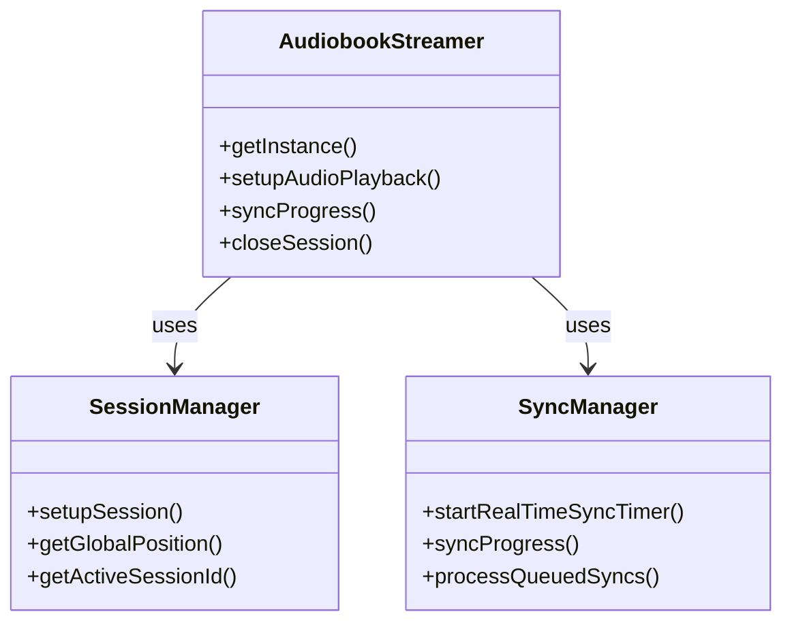

# AudiobookStreamer Refactoring Walkthrough & Architecture

This document details the refactoring of the `AudiobookStreamer` class and provides a deep dive into the new architecture involving `SessionManager` and `SyncManager`.

## Overview

The original `AudiobookStreamer` class was a "God object" handling session management, audio playback setup, synchronization logic, timers, and offline queueing. We have split this into three distinct classes to improve maintainability, testability, and separation of concerns.

## Architecture

### 1. AudiobookStreamer (The Facade)
**Role:** Coordinator & Public API
**Location:** `src/utils/rn-trackplayer/AudiobookStreamer.ts`

This class remains the main entry point for the rest of the application. It implements the Singleton pattern and exposes methods like `setupAudioPlayback`, `syncProgress`, and `closeSession`. However, it no longer contains the heavy lifting logic.

**Responsibilities:**
-   **Singleton Management:** Ensures only one instance exists.
-   **Event Listening:** Subscribes to `TrackPlayer` events (e.g., `PlaybackState`) and delegates actions to the managers.
-   **Coordination:** Orchestrates interactions between `SessionManager` and `SyncManager`. For example, when playback starts, it checks `SessionManager` for an active session and tells `SyncManager` to start the timer.
-   **Offline Mode:** Currently holds the high-level offline mode state (though this could be moved to a manager in the future).

### 2. SessionManager (The State)
**Role:** Session Data & Calculations
**Location:** `src/utils/rn-trackplayer/SessionManager.ts`

This class is responsible for everything related to the *current book* being played. It knows *what* is playing and *where* we are in the book.

**Responsibilities:**
-   **Session Data:** Stores the `AudiobookSession` object (metadata, chapters, tracks).
-   **Track Offsets:** Maintains the array of track start times to calculate global position.
-   **Global Position Calculation:** Converts the track-relative position (from `TrackPlayer`) into the absolute book position (seconds from the start of the book).
-   **Setup:** Fetches play info from the API and constructs the track list for `TrackPlayer`.
-   **Context Awareness:** Provides methods `getActiveSessionId()` and `getActiveLibraryItemId()` which check the *currently playing track* in `TrackPlayer` to ensure we don't sync data for the wrong book during a transition.

### 3. SyncManager (The Worker)
**Role:** Synchronization & Network
**Location:** `src/utils/rn-trackplayer/SyncManager.ts`

This class handles the "side effects" of playback: telling the server where we are. It manages time and network requests.

**Responsibilities:**
-   **Real-time Timer:** Manages the `setInterval` timer (default 60s) that triggers periodic syncs while playing.
-   **Immediate Syncs:** Handles "force sync" requests when pausing or stopping.
-   **Debouncing:** Prevents API spam by debouncing rapid position updates (e.g., during seeking).
-   **Queueing:** Uses `syncQueue` (MMKV-backed) to store sync requests when offline or when network errors occur.
-   **Retry Logic:** Automatically retries queued syncs when the network becomes available.
-   **Store Updates:** Updates the local Zustand store (`store-books`) to reflect progress in the UI immediately, throttled to avoid excessive re-renders.

## Interaction Flow

Here is how the classes interact during a typical playback session:

### Scenario 1: Starting Playback
1.  **UI** calls `AudiobookStreamer.setupAudioPlayback(itemId)`.
2.  **AudiobookStreamer** calls `SessionManager.setupSession(itemId)`.
3.  **SessionManager** fetches data, builds tracks, and returns them.
4.  **AudiobookStreamer** returns tracks to UI (which adds them to `TrackPlayer`).
5.  **User** presses Play.
6.  **TrackPlayer** emits `PlaybackState.Playing`.
7.  **AudiobookStreamer** receives event.
8.  **AudiobookStreamer** calls `SyncManager.startRealTimeSyncTimer()`.

### Scenario 2: Periodic Sync (While Playing)
1.  **SyncManager** timer fires (every 60s).
2.  **SyncManager** executes the callback provided by `AudiobookStreamer`.
3.  **AudiobookStreamer** calls `SessionManager.getGlobalPosition()` to get the current time.
4.  **AudiobookStreamer** calls `SyncManager.syncProgress(...)` with the ID and position.
5.  **SyncManager** sends API request to ABS server.

### Scenario 3: Pausing/Stopping
1.  **User** presses Pause.
2.  **TrackPlayer** emits `PlaybackState.Paused`.
3.  **AudiobookStreamer** receives event.
4.  **AudiobookStreamer** calls `SyncManager.stopRealTimeSyncTimer()`.
5.  **AudiobookStreamer** calls `SyncManager.syncProgress(...)` immediately (force sync).

### Scenario 4: Switching Books (Race Condition Handling)
1.  **UI** calls `AudiobookStreamer.setupAudioPlayback(newItemId)`.
2.  **AudiobookStreamer** calls `captureCurrentSessionForFinalSync()` (internal helper).
    -   It grabs the *current* session ID and position from `SessionManager` before they are overwritten.
3.  **AudiobookStreamer** calls `SessionManager.setupSession(newItemId)`.
    -   `SessionManager` updates its internal state to the new book.
4.  **AudiobookStreamer** ensures the final sync for the *old* book is sent using the captured data, preventing the new book's session ID from being used with the old book's position.

## Implementation Guide

### How to use `AudiobookStreamer` (Public API)

The public API remains largely unchanged, so existing code should work without modification.

```typescript
// Get instance
const streamer = AudiobookStreamer.getInstance(serverUrl, apiClient);

// Setup a book
const { tracks, sessionData } = await streamer.setupAudioPlayback(libraryItemId);

// Sync manually (e.g. on seek)
await streamer.syncPosition(newPosition);

// Close session (e.g. on component unmount or app background)
await streamer.closeSession();
```


### How to extend

-   **Adding new session data:** Update `SessionManager`.
-   **Changing sync behavior (e.g. offline strategy):** Update `SyncManager`.
-   **Handling new Player events:** Update `AudiobookStreamer` event listeners.

## Code Structure



