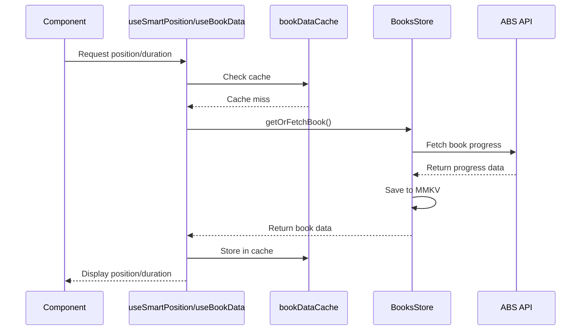
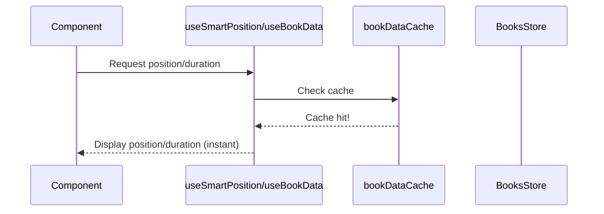
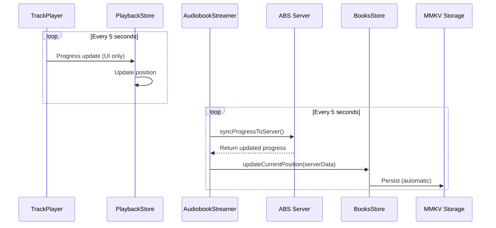

# Code Documentation - Position Tracking Architecture

## Overview

This document describes the position tracking architecture implemented for the Little Ape Audiobookshelf app. The system uses a **server-driven sync pattern** where the ABS server is the single source of truth for all playback position data. Stores are updated FROM server responses, ensuring consistency across devices and sessions.

## Architecture Principle: Server as Source of Truth

**Key Concept**: All position updates flow FROM the server TO the stores, never the reverse. This ensures:

- ✅ Multi-device sync (position updates from other devices)
- ✅ Consistent state across app restarts
- ✅ No conflicting position data
- ✅ Server always has the authoritative position

## Architecture Components

### 1. Store Layer

#### [`src/store/store-books.ts`](src/store/store-books.ts)

**Purpose**: Persistent storage for book metadata and playback state

**Book Type:**

```typescript
export type Book = {
  userId: string;
  libraryItemId: string;
  title?: string;
  playbackSpeed: number;
  isDownloaded: boolean;
  currentPosition: number; // Current playback position in seconds
  duration?: number; // Total book duration in seconds
  lastUpdated?: number; // Timestamp of last update (ms)
};
```

**Key Actions:**

- `getSavedBook(bookItem)` - Gets book from cache or creates new entry
- `getOrFetchBook({ userId, libraryItemId, title })` - **Async** - Gets from cache or fetches from server
- `updateCurrentPosition(libraryItemId, position, duration)` - Updates position and duration
- `updatePlaybackSpeed(libraryItemId, speed)` - Updates playback speed

**Storage**: Persisted to MMKV for offline access and app restart resilience

---

#### [`src/store/store-playback.ts`](src/store/store-playback.ts)

**Purpose**: Manages active playback session (ephemeral state)

**Key Features:**

- Tracks currently loaded book session
- Syncs position to books store every 10 seconds (throttled)
- Performs final position sync on pause/close
- Integrates with TrackPlayer and AudiobookStreamer

**Position Sync Flow:**

```
TrackPlayer Progress Event (every 5s)
  ↓
Playback Store Updates (every 5s)
  ↓
Books Store Updates (every 10s - throttled)
  ↓
MMKV Persistence (automatic via Zustand)
```

**Throttling Configuration:**

```typescript
const BOOK_STORE_UPDATE_INTERVAL = 10000; // 10 seconds
```

---

### 2. Hook Layer

#### [`src/hooks/trackPlayerHooks.ts`](src/hooks/trackPlayerHooks.ts)

**Performance-Optimized Split Hooks Architecture**

##### `useSmartPosition(libraryItemId, title)`

**Purpose**: Provides frequently updating position data for UI components

**Returns:**

```typescript
{
  position: number | undefined;
  isLoading: boolean;
  error: Error | null;
}
```

**Update Frequency**: ~4 times per second (250ms) during playback

**Use Cases:**

- Slider components
- Progress bars
- Current position displays

**Example:**

```typescript
const { position, isLoading, error } = useSmartPosition(bookId, title);
```

---

##### `useBookData(libraryItemId, title)`

**Purpose**: Provides static book metadata that rarely changes

**Returns:**

```typescript
{
  book: Book | null;
  duration: number | undefined;
  playbackSpeed: number;
  isLoading: boolean;
  error: Error | null;
}
```

**Update Frequency**: Only when book data changes (rare)

**Use Cases:**

- Duration displays
- Book metadata
- Playback speed settings

**Example:**

```typescript
const { duration, playbackSpeed, book } = useBookData(bookId, title);
```

---

##### Shared Cache

Both hooks share a `Map<string, Book>` cache to prevent duplicate API calls:

```typescript
const bookDataCache = new Map<string, Book>();
```

**Cache Flow:**

1. Component mounts → Both hooks check cache
2. Cache miss → First hook fetches from server
3. Fetched data → Stored in cache
4. Cache hit → Second hook reads from cache (no API call)

**Cache Management:**

```typescript
// Clear cache on logout or user switch
import { clearBookDataCache } from "@/src/hooks/trackPlayerHooks";
clearBookDataCache();
```

---

### 3. Component Layer

#### [`src/components/bookComponents/BookSlider.tsx`](src/components/bookComponents/BookSlider.tsx)

**Purpose**: Displays and controls playback position

**Hook Usage:**

```typescript
const { position } = useSmartPosition(bookId, title);
const { duration: bookDuration } = useBookData(bookId, title);

// Fallback chain: playback duration → book duration → 0
const duration = playbackDuration || bookDuration || 0;
```

**Benefits:**

- Duration available **before** pressing play
- Slider functional immediately on page load
- No unnecessary re-renders from duration changes

---

#### [`src/screens/BookViewer/BookContainer.tsx`](src/screens/BookViewer/BookContainer.tsx)

**Purpose**: Main book detail page

**Hook Usage:**

```typescript
const { position, isLoading, error } = useSmartPosition(bookid, title);
```

**Passes props to child components:**

```typescript
<BookSlider bookId={bookid} title={title} />
```

---

## Data Flow Diagrams

### Initial Book Load (First Visit)



### Subsequent Visits (Cached)



### During Playback (Server-Driven Sync)



---

## Performance Characteristics

| Metric               | Value             | Impact                           |
| -------------------- | ----------------- | -------------------------------- |
| Position updates/sec | ~4 (250ms)        | Only affects position consumers  |
| Duration updates     | 0 during playback | No re-renders for duration       |
| Books store updates  | Every 10s         | Throttled to reduce I/O          |
| API calls per book   | 1                 | Shared cache prevents duplicates |
| Memory overhead      | Minimal           | Simple Map cache                 |
| MMKV writes          | Every 10s         | Automatic via Zustand persist    |

---

## Performance Optimization Strategies

### 1. Split Hooks Pattern

**Problem**: Single hook returning all data causes re-renders for all consumers when any value changes

**Solution**: Separate hooks for frequently changing (position) vs static (duration) data

**Result**: Components only re-render when their specific data changes

### 2. Shared Cache

**Problem**: Multiple hooks fetching same data causes duplicate API calls

**Solution**: Module-level Map cache shared between hooks

**Result**: First hook to fetch populates cache for others

### 3. Throttled Updates

**Problem**: Updating books store every 5 seconds causes excessive MMKV writes

**Solution**: Throttle books store updates to 10-second intervals

**Result**: 50% reduction in storage I/O operations

### 4. Zustand Selectors

**Problem**: Components re-render when unrelated store data changes

**Solution**: Atomic selectors that only subscribe to specific data

**Result**: Minimal re-renders, optimal performance

---

## Usage Examples

### Basic Position Display

```typescript
import { useSmartPosition } from "@/src/hooks/trackPlayerHooks";

const PositionDisplay = ({ bookId, title }) => {
  const { position, isLoading, error } = useSmartPosition(bookId, title);

  if (isLoading) return <Text>Loading...</Text>;
  if (error) return <Text>Error: {error.message}</Text>;

  return <Text>{formatSeconds(position || 0)}</Text>;
};
```

### Duration Display

```typescript
import { useBookData } from "@/src/hooks/trackPlayerHooks";

const DurationDisplay = ({ bookId, title }) => {
  const { duration, isLoading } = useBookData(bookId, title);

  if (isLoading) return <Text>Loading...</Text>;

  return <Text>Total: {formatSeconds(duration || 0)}</Text>;
};
```

### Combined Usage (Slider)

```typescript
import { useSmartPosition, useBookData } from "@/src/hooks/trackPlayerHooks";

const BookSlider = ({ bookId, title }) => {
  const { position } = useSmartPosition(bookId, title);
  const { duration } = useBookData(bookId, title);

  return (
    <Slider value={position || 0} maximumValue={duration || 0} onSlidingComplete={handleSeek} />
  );
};
```

### Accessing Full Book Data

```typescript
import { useBookData } from "@/src/hooks/trackPlayerHooks";

const BookMetadata = ({ bookId, title }) => {
  const { book, duration, playbackSpeed } = useBookData(bookId, title);

  return (
    <View>
      <Text>Title: {book?.title}</Text>
      <Text>Duration: {formatSeconds(duration || 0)}</Text>
      <Text>Speed: {playbackSpeed}x</Text>
    </View>
  );
};
```

---

## Testing Checklist

When testing the position tracking system, verify:

- [ ] **First Visit**: Navigate to new book → Should fetch from server → Show position
- [ ] **Cached Visit**: Navigate to same book → Should show cached position instantly
- [ ] **Playback Update**: Play book → Position should update smoothly
- [ ] **Books Store Sync**: Position should update in books store every 10s
- [ ] **App Restart**: Close app → Reopen → Position should persist
- [ ] **Network Error**: Disable network → Navigate to new book → Should handle gracefully
- [ ] **Position Accuracy**: Play → Navigate away → Return → Position should be current
- [ ] **Multiple Books**: Switch between books → Each should maintain separate position
- [ ] **Slider Before Play**: Slider should show duration before pressing play
- [ ] **Performance**: No lag or stuttering during playback

---

## Troubleshooting

### Position Not Updating

**Check:**

1. TrackPlayer events are bound (`bindEvents()` called)
2. Playback store is receiving progress updates
3. Books store throttling isn't blocking updates
4. MMKV storage is working

### Duration Not Available

**Check:**

1. `useBookData` hook is being called
2. Book was successfully fetched from server
3. Server returned duration in response
4. Cache is populated correctly

### Duplicate API Calls

**Check:**

1. Both hooks are using shared cache
2. Cache key (libraryItemId) is consistent
3. Cache isn't being cleared prematurely

### Performance Issues

**Check:**

1. Components are using correct hook (position vs data)
2. Zustand selectors are atomic
3. Throttling is configured correctly
4. No unnecessary re-renders in DevTools

---

## Future Enhancements

### Planned Features

- [ ] Offline playback support for downloaded books
- [ ] Position sync across devices
- [ ] Chapter-based position tracking
- [ ] Playback history and analytics
- [ ] Smart resume (skip intro/credits)

### Performance Improvements

- [ ] Implement virtual scrolling for large book lists
- [ ] Add service worker for background sync
- [ ] Optimize MMKV batch writes
- [ ] Add position prediction for smoother UI

---

## Related Files

### Core Implementation

- [`src/store/store-books.ts`](src/store/store-books.ts) - Book metadata store
- [`src/store/store-playback.ts`](src/store/store-playback.ts) - Active playback store
- [`src/hooks/trackPlayerHooks.ts`](src/hooks/trackPlayerHooks.ts) - Position hooks
- [`src/utils/rn-trackplayer/AudiobookStreamer.ts`](src/utils/rn-trackplayer/AudiobookStreamer.ts) - Server sync

### UI Components

- [`src/components/bookComponents/BookSlider.tsx`](src/components/bookComponents/BookSlider.tsx) - Position slider
- [`src/screens/BookViewer/BookContainer.tsx`](src/screens/BookViewer/BookContainer.tsx) - Book detail page
- [`src/screens/Home/InProgressItem.tsx`](src/screens/Home/InProgressItem.tsx) - In-progress book item

### Supporting Files

- [`src/store/mmkv-storage.ts`](src/store/mmkv-storage.ts) - MMKV storage adapter
- [`src/utils/AudiobookShelf/absAPIClass.ts`](src/utils/AudiobookShelf/absAPIClass.ts) - API client

---

## Version History

### v1.0.0 (2025-10-04)

- Initial implementation of position tracking architecture
- Split hooks pattern for performance optimization
- Shared cache to prevent duplicate API calls
- Throttled updates to reduce I/O operations
- MMKV persistence for offline support

---

## Contributing

When modifying the position tracking system:

1. **Maintain Performance**: Keep hooks split, don't combine position and duration
2. **Preserve Cache**: Don't break the shared cache mechanism
3. **Test Thoroughly**: Verify all scenarios in testing checklist
4. **Update Docs**: Keep this document in sync with code changes
5. **Consider Offline**: Ensure changes work without network

---

## License

This documentation is part of the Little Ape Audiobookshelf project.
