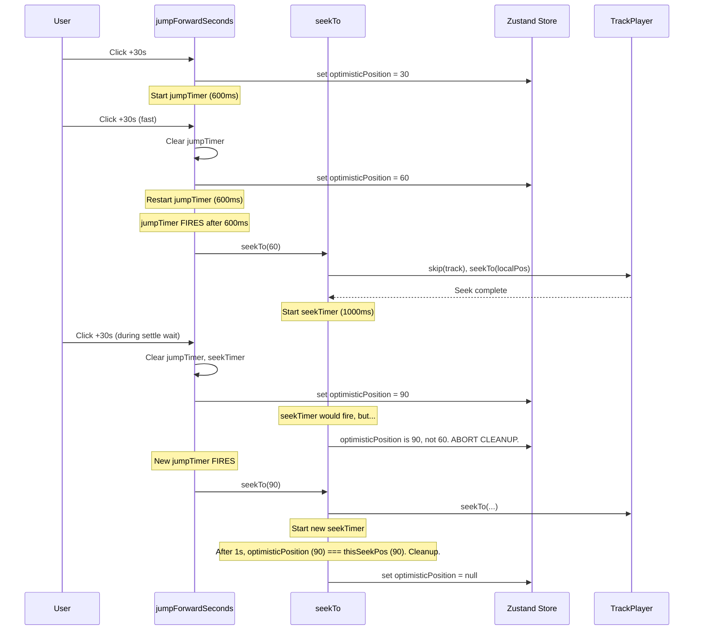

# Playback Seeking & UI Responsiveness

This document details the architecture for handling user-initiated seek and jump actions in the audiobook player. It focuses on achieving fast UI feedback while preventing glitches caused by the asynchronous nature of the `react-native-track-player` library.

## 1. Core Concepts

### Global Position

The player uses **global position** (in seconds, from the start of the entire audiobook) for all seeking and syncing. This is crucial for multi-file audiobooks where `TrackPlayer` internally works with file-relative positions.

- `seekTo(pos)` accepts a **global position**.
- It internally calculates the correct `trackIndex` and `localSeekPosition`.

### Optimistic UI Updates

To prevent UI lag while the audio player catches up, we use `optimisticPosition`:

- Set **immediately** when the user interacts (jump/seek).
- Cleared by a timer **after** the seek is complete and settled.
- `useSmartPosition` hook prioritizes this value, so the UI feels instant.

## 2. Jump Debouncing

Rapid clicks on "Jump Forward/Backward" are debounced.

```
User: Click +30s, +30s, +30s (rapidly)

Timeline:
  T=0:    Click 1. optimisticPosition = 30.
  T=100:  Click 2. optimisticPosition = 60. jumpTimer RESET.
  T=200:  Click 3. optimisticPosition = 90. jumpTimer RESET.
  T=800:  jumpTimer FIRES. seekTo(90) is called.
```

**Result:** Only one `seekTo` call for 90s, not three separate calls.

## 3. Race Condition Prevention

The interplay between `jumpTimer` (batches jumps) and `seekTimer` (cleans up optimistic state) can cause glitches. We employ multiple safeguards.

### 3.1 Timer Cancellation on New Jump

When a new jump starts, it immediately clears BOTH timers:

```typescript
if (jumpTimer) clearTimeout(jumpTimer);
if (seekTimer) clearTimeout(seekTimer); // Prevents stale cleanup from wiping new state
```

### 3.2 "Double Clear" After Async Await

Since `jump...Seconds` has `await` calls (for `getProgress`), another jump could happen during that await. We clear timers AGAIN after the await to prevent interleaving:

```typescript
// async jumpForwardSeconds(...)
const { position } = await TrackPlayer.getProgress(); // <-- Other jump could happen here
if (jumpTimer) clearTimeout(jumpTimer); // Clear again!
// ... schedule new timer
```

### 3.3 "Base Re-check" for Sequential Jumps

If `optimisticPosition` is `null` when a jump starts, we fetch from `TrackPlayer`. But if another jump finished _during_ that fetch, we re-check and use the new optimistic value:

```typescript
let base = get().optimisticPosition;
if (base === null) {
  const { position } = await TrackPlayer.getProgress();
  const freshOptimistic = get().optimisticPosition; // RE-CHECK!
  base = freshOptimistic !== null ? freshOptimistic : trackOffset + position;
}
```

### 3.4 Stale Check at Cleanup Time (Key Fix)

The `seekTimer` callback checks if the `optimisticPosition` has changed _since it was scheduled_. If a newer jump has set a different value, the cleanup is aborted.

```typescript
// Inside seekTo()
const thisSeekPos = pos;
seekTimer = setTimeout(() => {
  // Check at cleanup time, not scheduling time!
  if (get().optimisticPosition !== thisSeekPos) {
    return; // A newer jump took over, don't wipe its state.
  }
  set({ optimisticPosition: null });
}, 1000);
```

## 4. Diagram: Full Jump/Seek Interaction


