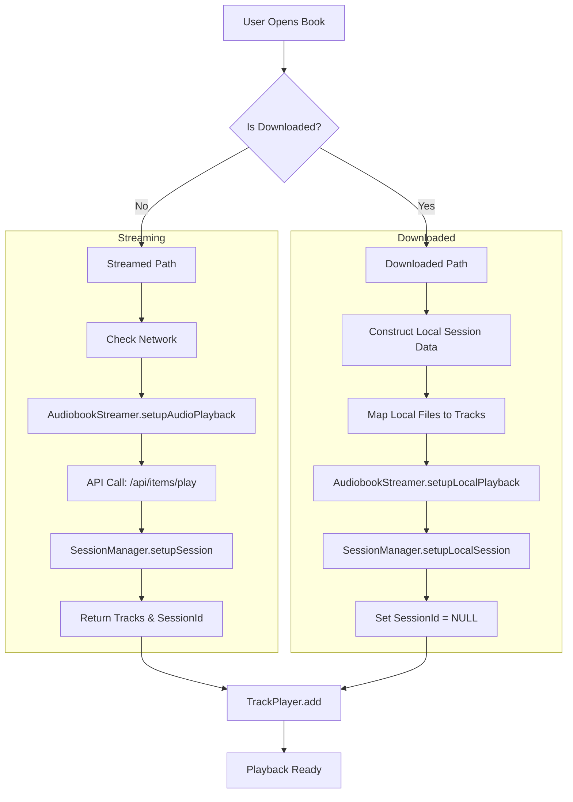
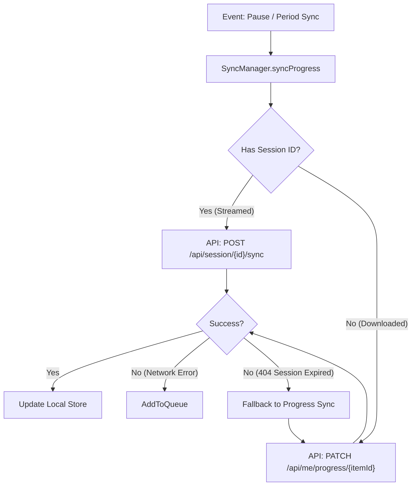
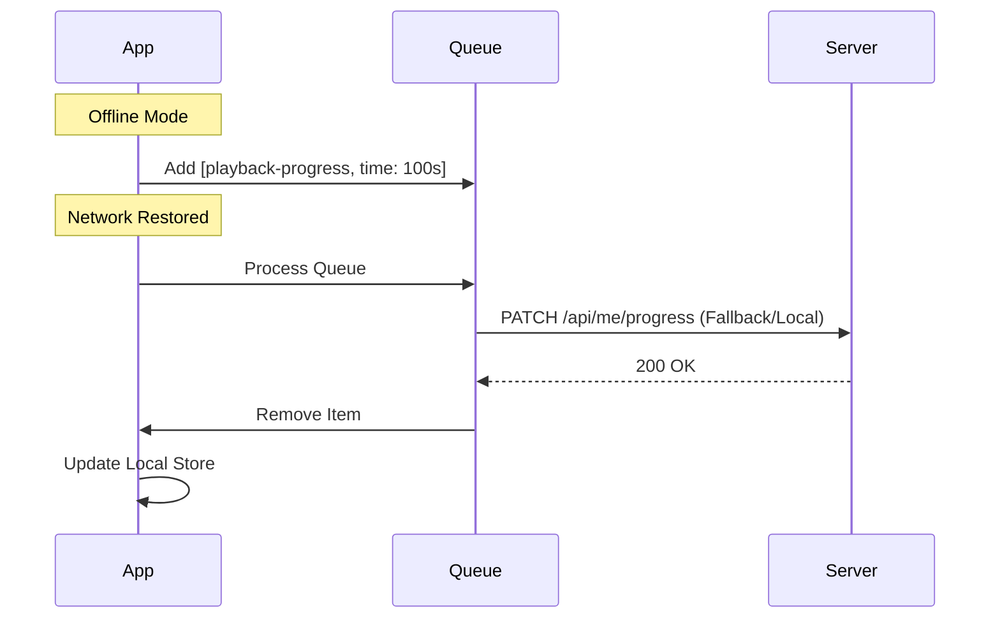
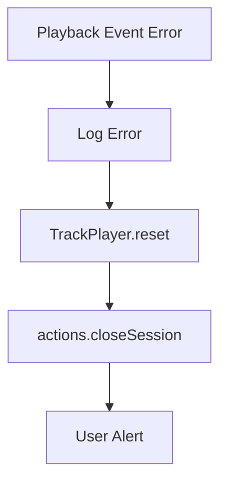

# Playback & Synchronization Flow

This document details the architecture for audiobook playback and server synchronization in the application. It covers how books are loaded, how progress is tracked, and how data is synced to the Audiobookshelf server (both online and offline).

## 1. High-Level Architecture

The system uses a **Unified Sync Architecture**. Whether a book is streamed from the server or played from local downloads, it routes through the same `AudiobookStreamer` singleton. This ensures consistency in how playback events are handled and synced.

- **`store-playback.ts`**: The entry point. Handles UI state and initializes the session.
- **`AudiobookStreamer.ts`**: The central controller. Listens to `TrackPlayer` events.
- **`SessionManager.ts`**: Holds session state. Distinguishes between "Server Sessions" (Streamed) and "Local Sessions" (Downloaded).
- **`SyncManager.ts`**: Handles the actual API calls, logic branching, and offline queuing.

## 2. Loading Flow: Streamed vs. Downloaded

When `loadBook(itemId)` is called in `store-playback.ts`, the flow bifurcates based on the book's status but converges on `AudiobookStreamer`.



### Key Differences

| Feature            | Streamed Path                  | Downloaded Path                   |
| :----------------- | :----------------------------- | :-------------------------------- |
| **Session ID**     | Assigned by Server (UUID)      | `null` / `undefined`              |
| **Media Source**   | Server URL (`/api/session...`) | Local File System (`file://...`)  |
| **Initialization** | `setupAudioPlayback(itemId)`   | `setupLocalPlayback(sessionData)` |

## 3. Synchronization Logic

Once playback starts, `AudiobookStreamer` listens for `PlaybackState` changes (Playing/Paused). It relies on `SyncManager` to persist progress.

### The Sync Decision Tree (`SyncManager.ts`)

The `SyncManager` intelligently chooses the correct API endpoint based on whether a Session ID exists.



### Code Reference: `SyncManager.ts`

```typescript
// Simplified logic from SyncManager.ts
public async syncProgress(sessionId: string | null, ...): Promise<void> {
  // ...
  if (sessionId) {
    // Path A: Server Session (Streamed)
    await this.apiClient.syncProgressToServer(sessionId, syncData);
  } else {
    // Path B: Local Progress (Downloaded)
    await this.apiClient.updateBookProgress(libraryItemId, syncData.currentTime);
  }
  // ...
}
```

## 4. Offline Handling & Queueing

If the user is offline or the server is unreachable, the request fails. The `SyncManager` catches this and queues the payload for later.

### Queueing Strategy

1.  **Capture**: The failed request data (`timeListened`, `currentTime`) is captured.
2.  **Persist**: The item is saved to `mmkv` storage via `SyncQueueManager`.
3.  **Type**: The item is marked as `playback-progress`.
    - _Note_: `sessionId` is stored as `undefined` for downloaded books.
4.  **Deduplication**: For `playback-progress` type, we employ a **Last-Write-Wins** strategy. Any existing queued item for the same `libraryItemId` is removed before adding the new one. This prevents redundant intermediate updates and ensures only the final offline position is sent to the server.

### Reconnection Flow

When the app comes back online (or on next app launch):

1.  `AudiobookStreamer` detects network change.
2.  Calls `processQueueOnReconnection()`.
3.  **Processing Logic**:
    - Iterates through the queue.
    - If item has `sessionId`: Tries session sync -> fails with 404 (likely expired) -> **Falls back** to progress sync.
    - If item has no `sessionId`: Directly calls progress sync (`updateBookProgress`).



## 5. Error Handling

### Playback Errors (`Event.PlaybackError`)

When streaming, network interruptions or invalid URLs (e.g., 404s, server down) can cause playback failures. These are handled via the `Event.PlaybackError` listener in `store-playback.ts`.

#### Error Flow

1.  **Detection**: TrackPlayer emits `PlaybackError`.
2.  **Reset**:
    - `TrackPlayer.reset()` is called to stop the player and clear the queue.
    - `actions.closeSession()` is called to clear the active session in the store.
3.  **Notification**: An `Alert` is displayed to the user explaining the error.


