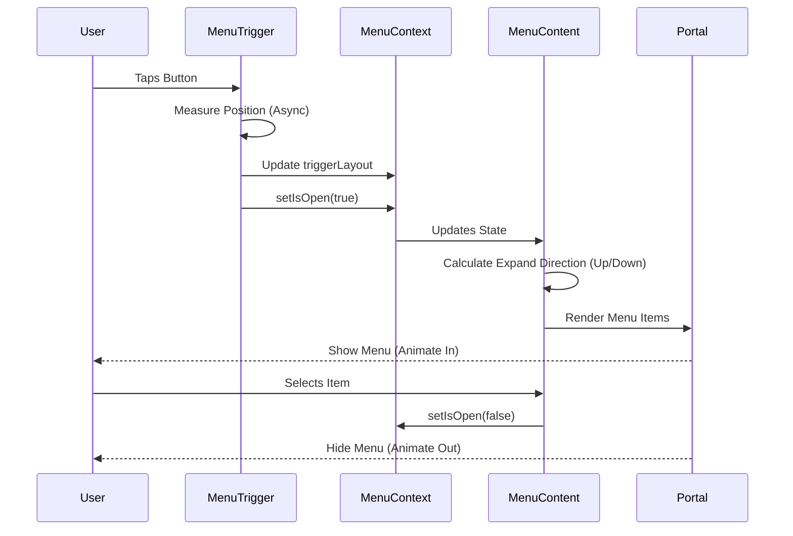

# AnimatedMenu Component

A highly customizable, animated menu component for React Native built with Reanimated, Gesture Handler, and Portals. It features smooth entrance/exit animations, automatic positioning, and support for custom styling.

## 1. Dependencies

This component relies on the following libraries:

- `react-native-reanimated`: For high-performance animations.
- `react-native-gesture-handler`: For interaction handling.
- `@gorhom/portal`: To render the menu above all other content (breaking out of overflow: hidden containers).
- `expo-symbols`: For SF Symbol icons (iOS).
- `react-native-safe-area-context`: For handling safe area insets (notches, home indicators).

## 2. Usage

### Basic Structure

Wrap your trigger and content with `AnimatedMenu`. Use `MenuTrigger` for the button that opens the menu, and `MenuContent` for the list of items.

```tsx
import {
  AnimatedMenu,
  MenuTrigger,
  MenuContent,
  MenuItemData,
} from "@/src/components/AnimatedMenu";

const MyComponent = () => {
  const menuItems: MenuItemData[] = [
    {
      key: "edit",
      label: "Edit",
      icon: "pencil",
      onPress: () => console.log("Edit"),
    },
    {
      key: "delete",
      label: "Delete",
      icon: "trash",
      textColor: "#EF4444",
      iconColor: "#EF4444",
      onPress: () => console.log("Delete"),
    },
  ];

  return (
    <AnimatedMenu>
      <MenuTrigger>
        {/* Your button UI here */}
        <View style={{ padding: 10, backgroundColor: "blue" }}>
          <Text>Open Menu</Text>
        </View>
      </MenuTrigger>

      <MenuContent items={menuItems} />
    </AnimatedMenu>
  );
};
```

### Menu Items Configuration

The `items` prop accepts an array of `MenuItemData`.

```typescript
interface MenuItemData {
  key: string; // Unique identifier
  label: string; // Text to display
  icon?: SFSymbol; // SF Symbol name (optional)
  iconColor?: string; // Hex color for icon (optional)
  textColor?: string; // Hex color for text (optional)
  disabled?: boolean; // Disable interaction
  onPress?: () => void; // Callback function
}
```

**Separators**: To add a separator line, use a key starting with "separator" and an empty label.

```typescript
{ key: "separator-1", label: "" }
```

## 3. Component Architecture

### Component Interaction Diagram

```mermaid
graph TD
    User[User Interaction]

    subgraph AnimatedMenu Component
        Context[MenuContext]
        Trigger[MenuTrigger]
        Content[MenuContent]
        Portal[Portal]
    end

    User -->|Tap| Trigger
    Trigger -->|1. Measure Position| Context
    Trigger -->|2. Toggle Open State| Context

    Context -->|State Change| Content

    Content -->|Render| Portal
    Portal -->|Display at Root| Screen

    subgraph Positioning Logic
        Measure[Measure Trigger (x, y, w, h)]
        Safe[Safe Area Adjustment]
        Shared[Shared Values (UI Thread)]
    end

    Trigger -.-> Measure
    Measure -.-> Safe
    Safe -.-> Shared
    Shared -.-> Content
```

### State Flow



## 4. How it Works

### 1. The Portal Pattern

The menu uses `@gorhom/portal` to render the menu content at the root of the application tree. This is crucial for:

- **Z-Index Management**: Ensuring the menu appears on top of everything.
- **Overflow Handling**: Allowing the menu to extend outside of headers or scroll views that might have `overflow: hidden`.

### 2. Context & State

`AnimatedMenu` acts as the provider. It holds the state:

- `isOpen`: Boolean visibility state.
- `triggerLayout`: The absolute position `{x, y, width, height}` of the trigger button.

### 3. Positioning Logic

Since the menu is rendered in a Portal (at the root), it loses its relative position to the trigger. We solve this by:

1. **Measuring**: When the trigger is tapped, `measureInWindow` captures its absolute screen coordinates.
2. **Safe Area**: We adjust coordinates using `react-native-safe-area-context` to account for headers and notches (especially important when the trigger is inside a navigation header).
3. **Shared Values**: These coordinates are converted to Reanimated `SharedValues` so the UI thread can update the position instantly without crossing the bridge.

### 4. Animations

- **Entrance**: Staggered fade-in and spring animations for list items.
- **Exit**: Fade-out animation.
- **Backdrop**: Smooth fade-in of a dimming layer.

## 5. Developer Guide

### Modifying Animations

Animations are defined in `MenuItem.tsx` using `react-native-reanimated`.

- `enteringAnimation`: Controls how items appear (currently `FadeIn.springify()`).
- `exitingAnimation`: Controls how items disappear.
- `STAGGER_DELAY`: Constant defining the delay between each item's animation.

### Adding New Item Types

1. Update `MenuItemData` interface in `types.ts`.
2. Update `MenuContent` in `AnimatedMenu.tsx` to handle the new type (e.g., checking `item.type`).
3. Create a new component (like `MenuSeparator`) and render it conditionally in the map loop.

### Troubleshooting Positioning

If the menu appears in the top-left corner (0,0):

- Check if `triggerLayout` is being set correctly.
- Ensure `measureInWindow` is returning valid coordinates.
- Verify `useSafeAreaInsets` is correctly imported and used if the trigger is in a header.
